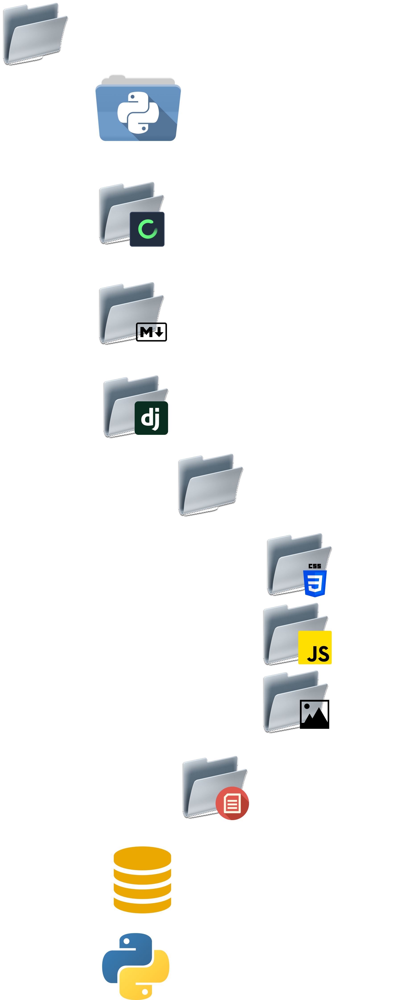
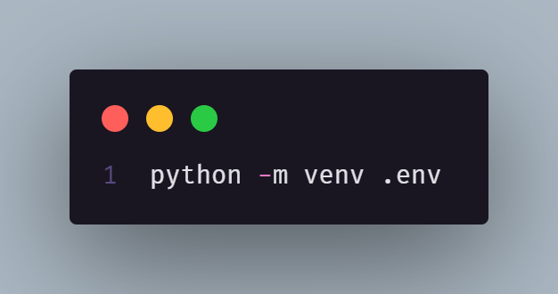
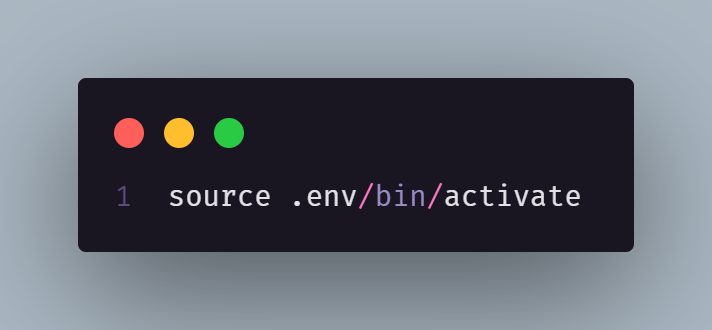
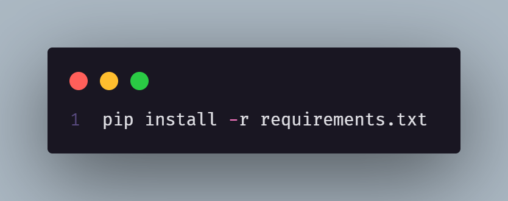
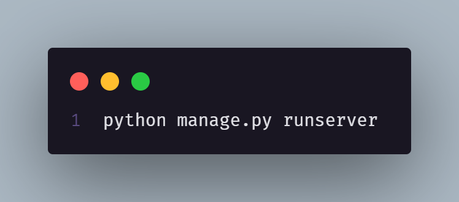

# Introduction 📝

Flexy PDV is a comprehensive web-based Point of Sale (POS) application, designed to optimize and simplify retail business management. The application allows efficient sales registration, detailed daily sales analysis, real-time inventory control, and intuitive product management. Built with Django on the back-end and JavaScript on the front-end, utilizing TailwindCSS for responsive design and Jazzmin for the administration interface, Flexy PDV ensures a robust and responsive user experience, both on mobile devices and desktops.

# File Structure 📂

- `.env`: File for Python virtual environment (venv)
- `Flexy`: Django project
    - `PDV`: Flexy Django project app
        - `static`: Folder with static files
            - `Css`: Folder with CSS files
            - `Js`: Folder with JavaScript scripts
            - `Img`: Folder with images
        - `Views`: Folder with Django views
- `Markdown`: Folder with all images for markdown file
- `db.sqlite`: SQLite database
- `manage.py`: Script to manage Django project

# 🌟 Distinctiveness and Complexity

Flexy goes beyond being just another POV application or inventory manager. Its uniqueness and complexity lie in its comprehensive approach to business management. Here's why Flexy stands out:

    1.Comprehensive Functionality: While many applications focus on specific areas like sales or inventory, Flexy offers a complete solution. It allows for product management, sales recording, and detailed analysis, all in one place. Users can handle all aspects of their business seamlessly.

    2.Real-Time Inventory Control: Monitoring inventory in real-time is crucial for any business. Flexy provides this feature, ensuring users always know which products are available and which need restocking. This not only simplifies daily operations but also helps prevent stockouts during critical times.

    3.Detailed Sales Analysis: Making strategic decisions requires precise and actionable information. With Flexy, users can access detailed reports on daily sales, enabling in-depth analysis of business performance over time. This facilitates the identification of patterns, trends, and areas for improvement easily.

    4.User-Friendly Interface: Despite its complexity, Flexy's interface remains user-friendly. Designed to be intuitive and easy to navigate, even users without technical expertise can start using Flexy effortlessly. This reduces the learning curve and increases adoption rates.
    
# How to Run the Application 🔛

## 1. Install Python Virtual Environment

    

## 2. Activate Python Virtual Environment

    

## 3. Install Dependencies

    

## 4. Execute the Application

    

# Routes and Endpoints 🌐

## Authentication 🔐

    GET /: Login page.
    POST /register: New user registration page.
    POST /logout: Logout of the current user.

## Payment 💳

    GET /pagamento: Payment page.
    GET /resumoCompra/<int:cod>: Displays the summary of the purchase with the provided code.
    POST /removeCompra/<int:cod>: Remove the purchase with the provided code.

## Product Management 📦

    POST /cadastrar: Register a new product.
    POST /excluir: Delete a product.
    POST /excluir/<int:id>: Delete a specific product by ID.
    POST /editar: Edit a product.
    POST /editar/<int:id>: Edit a specific product by ID.
    GET /itemSelecionado/<int:id>: Displays the details of a specific product by ID.

## Sales 🛒

    POST /registrar_venda: Register a new sale.
    GET /vendas: Render the sales page.

## CSV 📄

    POST /upload_csv: Upload products via CSV.
    GET /dadosVenda/<int:id>: Displays the data of a specific sale by ID.

## Exchanges 🔄

    POST /troca/<int:id>: Make an exchange of an item by ID.
    GET /codVerify/<int:cod>: Verify an exchange code.
    GET /dadosEmpresa/<str:user>: Displays the company data of the user.

## Analysis 📊

    GET /analise/: Analysis page.
    GET /analise/getMetodoPagamento: Get the payment methods used.
    GET /analise/getTopProdutosPerHour: Get the top-selling products per hour.
    GET /analise/getVendasPerHour: Get the sales per hour.
    GET /analise/getVendasPerVendedor: Get the sales per vendor.

# Presentation 🎥

    Check out a presentation of Flexy PDV on YouTube: 

 `Click Here!!`

# License 📜

This project is licensed under the MIT License. See the [LICENSE](https://opensource.org/license/mit) file for more information.

Copyright 2024 Iuri de Lima Ferreira

Permission is hereby granted, free of charge, to any person obtaining a copy of this software and associated documentation files (the “Software”), to deal in the Software without restriction, including without limitation the rights to use, copy, modify, merge, publish, distribute, sublicense, and/or sell copies of the Software, and to permit persons to whom the Software is furnished to do so, subject to the following conditions:

The above copyright notice and this permission notice shall be included in all copies or substantial portions of the Software.

THE SOFTWARE IS PROVIDED “AS IS”, WITHOUT WARRANTY OF ANY KIND, EXPRESS OR IMPLIED, INCLUDING BUT NOT LIMITED TO THE WARRANTIES OF MERCHANTABILITY, FITNESS FOR A PARTICULAR PURPOSE AND NONINFRINGEMENT. IN NO EVENT SHALL THE AUTHORS OR COPYRIGHT HOLDERS BE LIABLE FOR ANY CLAIM, DAMAGES OR OTHER LIABILITY, WHETHER IN AN ACTION OF CONTRACT, TORT OR OTHERWISE, ARISING FROM, OUT OF OR IN CONNECTION WITH THE SOFTWARE OR THE USE OR OTHER DEALINGS IN THE SOFTWARE.

